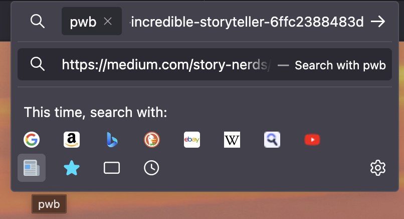
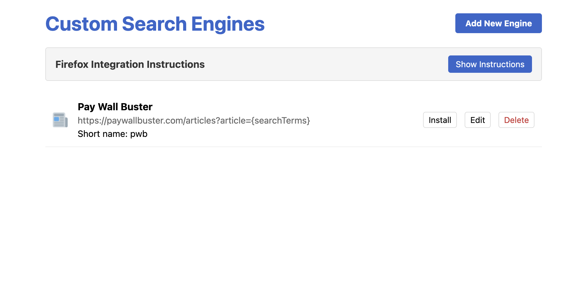

# Custom Search Engines Firefox Extension

This Firefox extension allows users to add custom search engines to Firefox's search functionality. Get back full control over search.

**Install from the Firefox Addons Marketplace**
https://addons.mozilla.org/en-US/firefox/addon/add-custom-search-engines/

## Quick Look
#### Search Preview

#### Settings Screen

## Features

- Add custom search engines with their search URL
- Support for both GET and POST search methods
- Custom icons for each search engine
- Quick access from the toolbar popup
- Omnibox integration using the "@" keyword
- Manage search engines through a settings page

## Installation

**Install from the Firefox Addons Marketplace**
https://addons.mozilla.org/en-US/firefox/addon/add-custom-search-engines/

## Manual Installation

1. Download the extension files
2. Open Firefox and go to `about:debugging#/runtime/this-firefox`
3. Click "Load Temporary Add-on..."
4. Select any file from the extension folder

## Usage

### Adding a Search Engine

1. Click the extension icon in the toolbar
2. Click "Settings" in the popup
3. Click "Add New Engine"
4. Fill in the form:
   - **Name**: Display name for the search engine
   - **Search URL**: The URL with `{searchTerms}` where the query should be inserted
   - **Icon URL**: URL to the icon image (favicon, PNG, or SVG)
   - **HTTP Method**: GET (default) or POST
   - **Short Name**: Optional short name for omnibox access

### Using a Search Engine

#### From the Popup:
1. Click the extension icon in the toolbar
2. Enter your search terms
3. Click on the search engine button

#### From the Address Bar (Omnibox):
1. Type "@" followed by the search engine's short name and your search terms
2. Example: `@gpt how to create a Firefox extension`

## File Structure

- `manifest.json`: Extension configuration
- `background.js`: Background script for main functionality
- `popup.html` & `popup.js`: Toolbar popup UI
- `options.html` & `options.js`: Settings page UI
- `search.html` & `search.js`: Helper page for POST requests
- `icons/`: Extension icons

## Customization

You can modify the UI styling by editing the CSS in the HTML files. The extension uses browser storage to save search engines, so your data persists between browser sessions.

## License

This project is open sourced, under the MIT License. Feel free to modify and distribute as needed.
